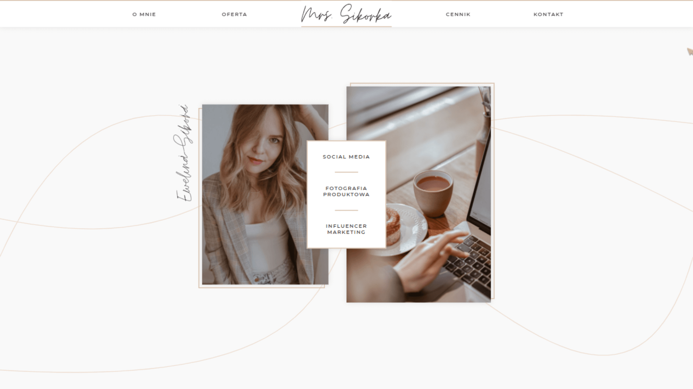
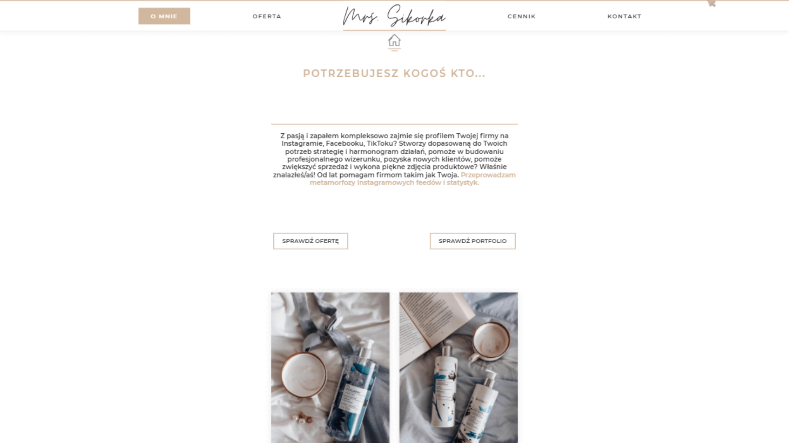
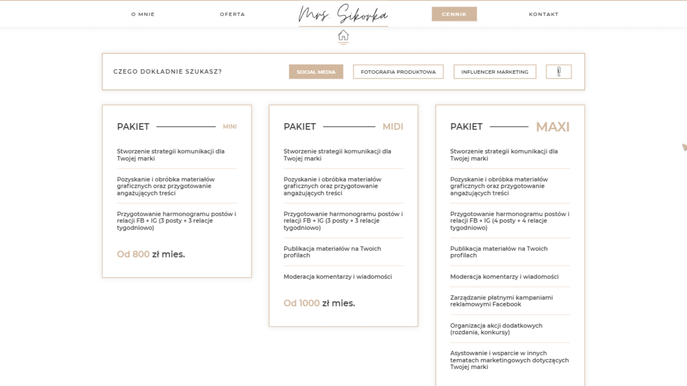
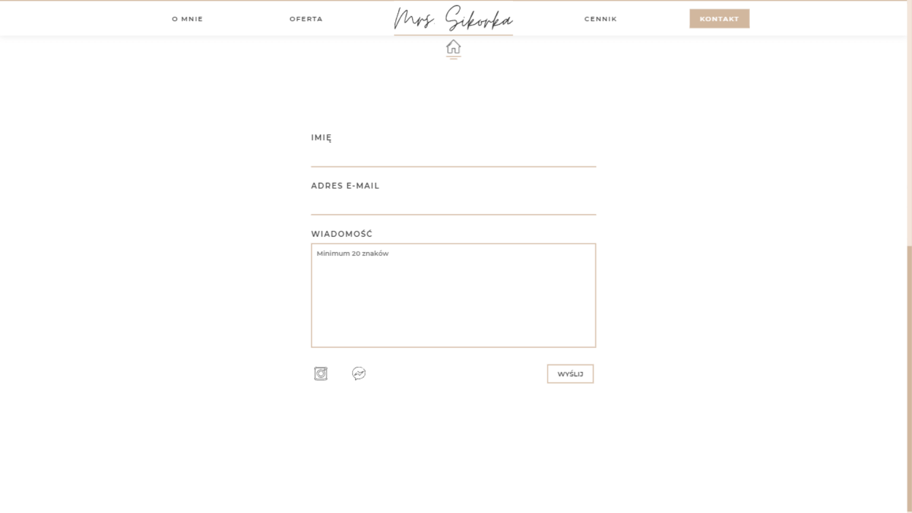

<br />
<br />


<br />
<br />

# Mrs.Sikorka - Influencer marketing 💻

https://mrssikorka.pl/

<br />

### About Project

Whole project is a simple website for Mrs. Ewelina, she's pretty good at influencer marketing and products photography. When I saw that she's only using Instagram for her business I've offered my help.

<br />

## Used Technologies
* React - version 17.0.2
* React-router-dom - version 5.3.0
* Styled-components - version 5.3.1
* Framer-motion - version 4.1.17
* Email.js - version 3.2.0

<br />

## Features

- Playing with .svgs path's to animate them
- Price list (toggle between different services)
- Nice looking cursor
- Email sending + form validation

<br />

## How to run?

1. Clone the project

```bash
  git clone https://github.com/BlackAndWhiteCarnage/Mrs.Sikorka
```

2. Install dependencies

```bash
  npm install
```

3. Run project

```bash
  npm start
```

<br />

## Quick Preview

### Home Page


### About Me


### Price List


### Contact


<br />

## Author

- [@BlackAndWhiteCarnage](https://github.com/BlackAndWhiteCarnage)
